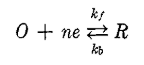
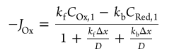
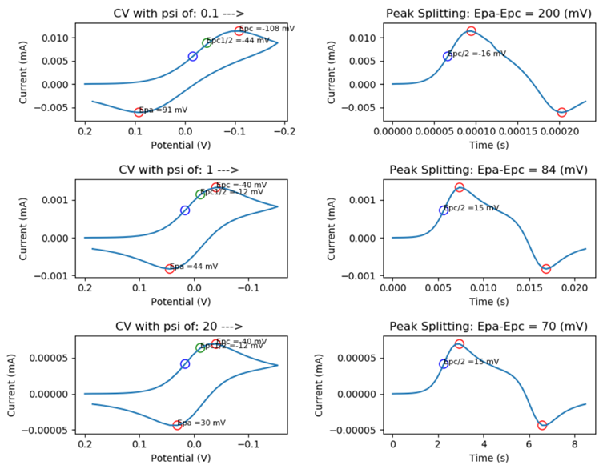
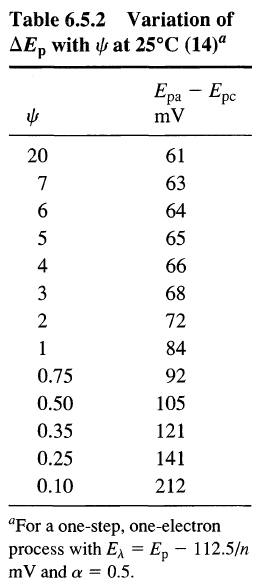

# Simulations of Cyclic Voltammetry for a Quasireversible System
My attempt at answering question B.5. (Appendix B: Digital Simulations of Electrochemical Problems) from __Electrochemical methods : fundamentals and applications__ (Bard, 2001) p. 807.

Author: Tristan Chauvin-Bosse.

### Question B.5
> "Using a computer, carry out simulations of cyclic voltammetry for a quasireversible system. Let t = 50 and DM = 0.45. Take a = 0.5 and let the diffusion coefficients of the oxidized and reduced forms be equal. Cast your dimensionless intrinsic rate parameter in terms of the function ф defined in (6.5.5), and carry out calculations for ф = 20, 1, and 0.1. Compare the peak splittings in your simulated voltammograms with the values in Table 6.5.2."

(Bard, 2001) p. 807.

### Example use
Given a list of three values for the dimensionless intrinsic rate parameter (ψ), a function called CV generates a simulation of cyclic voltametry for a quasireversible system and plots the results. The scan rate is determined by ψ through equation 6.5.5 p.242 (Bard & Faulkner, 2001).

```python quaisRevCVsim.py --psi 0.1 1 20```

## Introduction
Cyclic voltammetry (CV) is a versatile electrochemical experiment which is most commonly used to study the properties of an analyte (Kissinger & Heineman, 1983). CV can be used to determine standard rates of electron reaction mechanisms and diffusion coefficients (Aristov & Habekost, 2015). It is one of the most widely employed methods in electrochemistry. It is a type of potential sweep which imposes a saw tooth like potential/time regime to an electrochemical system with the use of a potentiostat. The working electrode is immersed in a solution containing some electroactive analyte, an excess of electrolyte, a reference electrode, and a counter electrode. The potentiostat passes the current in between the working and auxiliary electrodes to maintain a specific  potential/time regime. Current is recorded as a function of potential which is equivalent to recording the potential versus time (Rudolph, Reddy, & Feldberg, 1994). Typically, we chose a starting potential at which the analyte is electro-inactive. For the one-step one electron process depicted in figure 1, (Matsuda & Ayabe, 1955) were the first to express the boundary condition as described in their eq. (33) or as eq. 6.4.2 p. 236 (Bard & Faulkner, 2001).



**Figure 1:** One-step one electron Reaction mechanism which is considered (Nicholson, 1965).

Nicholson and Shain further described the dependence of single scan CV methods as applied to reversible, irreversible and kinetic systems (Nicholson, 1965; Nicholson & Shain, 1964). They used numerical methods to solve integral (eq. 13) in their paper which generates all possible potential current responses for stationary planar electrodes. One year later, Nicholson published a paper title Theory and Application of Cyclic Voltammetry for Measurement of Electrode Reaction Kinetic (Nicholson, 1965) which contains the table 6.5.2 in p. 243 of (Bard & Faulkner, 2001). In the footnote of this table it specifies that it is for a process with a reversal potential equal to peak potential – 112.5/n electrons while for the case of the actual table cited Nicholson derived his equations using a difference in between reversal potential and EE<sub>1/2</sub> of 141/n mV. They we’re the first to introduce the nondimensional parameter ψ  which described the relationship in between the standard rate constant and mass transport. From peak splitting of voltammograms, one can determine the extent to which an electrochemical system is reversible. Problem B.5 on p.807 in appendix B pertaining to digital simulations of electrochemical problems poses the task of comparing values obtained for peak splitting in simulated voltammograms for quasireversible systems having ψ equal to 20, 1 and 0.1. By assuming our inaptitude in solving the system of equations described by (Nicholson, 1965) with its 6 corresponding boundary conditions, we decide to resort to numerical simulations. 

## Program Description
To solve problem B.5, a program was written in python. Given a list of three values of ψ, a function called CV generates various simulations and plots the results. Given an electrochemical rate constant, the scan rate is determined by ψ through equation 6.5.5 p.242 (Bard & Faulkner, 2001).
In the Butler-Volmer model of electrode kinetics, kf and kb, which are the heterogeneous rate constants for the redox coupled involved, can be expressed by equations 3.3.9 and 3.3.10 p. 96 (Bard & Faulkner, 2001). We start by assuming semi-infinite linear diffusion of O and R at a planar electrode with no presence of R initially. To properly describe the effects of concentration polarization we assume that diffusion is the only source of mass transport. We apply a discrete form of flicks second law of diffusion eq. B.1.8 p. 787 (Bard & Faulkner, 2001). The rate of mass transfer in between the electrode’s surface and the first element of volume can be expressed through the overpotential by the flux J<sub>ox</sub> or J<sub>A</sub> (simulation notation). It is computed according to equation (9) in (Brown, 2015) which takes the form of:



**Figure 2:** Flux boundary condition at the electrode’s surface as used in simulation.

This equation is obtained by rearranging B.1.16 p. 791 (Bard & Faulkner, 2001) to express fractional concentrations in the first element of volume. These expressions are then substituted into B.4.9 p. 799 (Bard & Faulkner, 2001). By letting J<sub>A</sub> = - J<sub>B</sub>  and rearranging we obtain the final form (figure 2).  The details are nicely outlined in a website created by Peter M. Attia (2019) who wrote a MATLAB script for simulation of EC mechanism effectively answering equation B.6. p. 807 (Bard & Faulkner, 2001). This boundary conditions is also described as (eq. 12) in (Codina, Sanchez, & Aldaz, 1991). 

The discrete model used to answer the question consisted of 50 volume elements with the corresponding same amount of iterations. Calculation for diffusion is performed for every iteration and is only ever computed for what would be relevant to the model as described by equation B.1.23 p. 793 (Bard & Faulkner, 2001). After the diffusion process has been resolved, flux is computed using the equation in figure 2. From it, surface concentrations are updated according to equations (11) and (12) in (Brown, 2015) and the iteration’s current can also be calculated.

After all iterations/timesteps are complete, the numerical simulation part of the program ends. Obtained data is subjected to post process analysis to extract parameters such as peak anodic and cathodic potentials. The difference in between reversal potential and E<sub>1/2</sub> are computed for the obtained simulation. It is then compared to the value of 141/n mV which was used in the derivation of table 1 (Nicholson, 1965). If the difference in between the reversal potential and E<sub>1/2</sub> is off by more than a set value (in the case of this program the variable is called sensitivity and is set to 1 mV) the reversal potential for the simulation is changed, and the simulation re-executed. Once a valid simulation for ψ equal to 0.1, 1 and 20 are obtained, the results are displayed as cyclic voltammograms to the user.

## Results and Discussion
From the program we obtain peak splitting of simulated CV for various values of ψ. For ψ equal to 20 we obtain a reversible system with peak splitting of 70 mV. For ψ equals to 1 and 0.1 we obtain quasireversible systems with peak splits of 84 and 200 respectively. For the case of ψ equals 20, 1 and 0.1 the splitting values are 9 mV, 0 mV and 12 mV less  than the ones obtained from the infinite series solution of Nicholson’s integral equation (13) (Nicholson, 1965). All results for peak splitting agree within 15% of the ones in table 6.5.2 p. 243 (Bard & Faulkner, 2001). The largest variation can be observed for ψ equal to 20 (most reversible) as can be seen in table 1. Note that the peak current obtained using the Randles-Sevcik equation is closest to peak current for simulations having ψ equal to 0.1 which makes little sense since it is employed in reversible systems. Values are very far off from simulation current which raises doubt as to their validity. If amount of iterations for the simulation are increased by a factor of 10, peak splitting of 61 mV, 78 mV and 187 mV for psi 20, 1 and 0.1 are respectively obtained. 



**Figure 3:** Example of simulated CV for varying ψ with alpha = 0.5, Dm = 0.45, K0 = 0.2, DA = Db = 1*10-5 cm^2/s,  CA = 1.0*10-6, A = 4 cm^2 and n = 1 at 25 Degreese C. 

| ψ | 0.1  |  1 | 20  |
|-------------|:-------------:|:-------------:|:-------------:|
| Lambda| 	0.18| 	1.77| 	8.65| 
| Characteristic Time(s)| 	0.000235| 	0.0216| 	12.0| 
| K0 (cm/s)| 	0.2| 	0.2| 	0.2| 
| Delta X (cm)| 	1.024*10^-5| 	9.807*10^-5| 	0.00196| 
| Delta T (s)| 	4.719*10^-6| 	0.000432| 	0.1731| 
| Peak Cathodic current (mA)| 	0.01137| 	0.001326| 	6.9*10^-5| 
| Peak current computed using Randles–Sevcik equation (mV)| 	194| 	19.5| 	0.973| 
| Reversal potential – Peak potential ½ (mV)| 	-141| 	-141| 	-141| 
| Diff in between Peak Splitting obtained and peak splitting from table 6.5.2 (%)| 	5.8| 	0.0| 	13| 
| Peak splitting (mV)| 	200| 	84| 	70| 
| Scan rate (V/s)| 	3271| 	33| 	0.081|


**Table 1:** Simulation parameters used to generate Figure 3.

## Future Work
In section B.4.2 on boundary conditions of heterogenous kinetics, bard describes a method for calculating fractional concentrations in the first box of a simulation. After much trial and error I had to abandon trying to implement this method and opt for the methods outlined in (Brown, 2015), (Codina et al., 1991) and (Attia, 2019). The excel spread sheet supplied with (Brown, 2015) along with the MATLAB code supplied in (Attia M., 2018) was instrumental in initially setting up the numerical simulation part of this program. Much more work should have been put into the non dimensionalization of the simulation. For further work regarding numerical simulation of electrochemical systems (Britz & Strutwolf, 2016) will be considered. The available materials supplied with this ebook contain many programs written in Fortran 90 which can be a good starting point for someone who is familiar with this language.

## Dependencies
Install [Python](https://www.python.org/downloads/)

```pip install matplotlib```

```pip install numpy```


## Refrences
Attia M., Peter (2018). __Cyclic Voltammetry App: Simulation walkthrough.__ 
https://petermattia.com/cyclic_voltammetry_simulation/simulation.html.

Aristov, N., & Habekost, A. (2015). __Cyclic Voltammetry - A Versatile Electrochemical Method Investigating Electron Transfer Processes.__ World Journal of Chemical Education, 3(5), 115-119. doi:10.12691/wjce-3-5-2

Bard, A. J., & Faulkner, L. R. (2001). __Electrochemical methods : fundamentals and applications (2nd ed. ed.)__. New York: Wiley.

Britz, D., & Strutwolf, J. r. (2016). __Digital simulation in electrochemistry__. In Monographs in electrochemistry.

Brown, J. H. (2015). __Development and Use of a Cyclic Voltammetry Simulator to Introduce Undergraduate Students to Electrochemical Simulations__. Journal of Chemical Education, 92(9), 1490-1496.

Codina, G., Sanchez, G., & Aldaz, A. (1991). __Digital simulation of cyclic voltammetry on heterogenous electrodes__. Electrochimica Acta, 36(7), 1129-1133. doi:https://doi.org/10.1016/0013-4686(91)85099-S

Kissinger, P. T., & Heineman, W. R. (1983). __Cyclic voltammetry__. Journal of Chemical Education, 60(9), 702. doi:10.1021/ed060p702

Matsuda, H., & Ayabe, Y. (1955). __Zur Theorie der Randles‐Sevčikschen Kathodenstrahl‐Polarographie__. Zeitschrift für Elektrochemie, Berichte der Bunsengesellschaft für physikalische Chemie, 59(6), 494-503. doi:10.1002/bbpc.19550590605

Nicholson, R. S. (1965). __Theory and Application of Cyclic Voltammetry for Measurement of Electrode Reaction Kinetics__. Analytical Chemistry, 37(11), 1351-1355. doi:10.1021/ac60230a016

Nicholson, R. S., & Shain, I. (1964). __Theory of Stationary Electrode Polarography__. Single Scan and Cyclic Methods Applied to Reversible, Irreversible, and Kinetic Systems. Analytical Chemistry, 36(4), 706-723. doi:10.1021/ac60210a007

Rudolph, M., Reddy, D. P., & Feldberg, S. W. (1994). __A Simulator for Cyclic Voltammetric Responses__. Analytical Chemistry, 66(10), 589A-600A. doi:10.1021/ac00082a725

## Appendix

